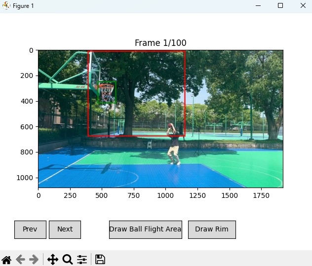
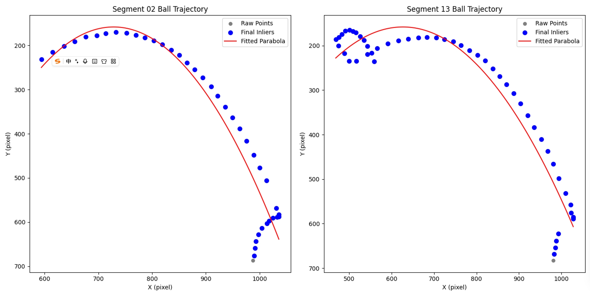

# SportsVideos

This repository provides an example pipeline for monocular basketball scene reconstruction, resulting in 3D shooting motions and the estimated 3D trajectories of the ball.

## Example Data Source

- Example video data (`single_view.mp4`) can be downloaded here:
  [Google Drive Link](https://drive.google.com/file/d/1lGGBksdnlsLvbbDMrlzqVLa31vHjDKFi/view?usp=sharing).

- After downloading, please place `single_view.mp4` into the `input/` directory.

## Prerequisites

Ball and human detection in this project are implemented using [YOLOv5](https://github.com/ultralytics/yolov5) (AGPLv3 License).

```bash
git submodule update --init
```

Installation dependencies include:

- Python 3.8+
- PyTorch
- OpenCV

```bash
pip install -r requirements.txt
```

## 1. Data Preprocessing

**a.** Select the `ball_flight_area` and `rim` interactively via the graphical user interface. All related data files are then saved in the `./metadata` directory.

```bash
python 1_data_preprocess/select_flight_area.py
```

**Example of selecting the `ball_flight_area` and `rim` via the GUI:**


**b.** Next, the position of the basketball in each frame is detected using a YOLOv5-based model.
The YOLO weights used for basketball detection are referenced from the [Stardust87/basketball-detection](https://github.com/Stardust87/basketball-detection) repository (MIT License).

```bash
python 1_data_preprocess/detect_basketball.py
```

**c.** The detection results (bounding box information for the basketball in each frame) are saved in the `./output/single_view/labels` directory.

**Sample Ball Detection Result:**


**d.** Finally, the `segment_shooting_videos.py` script automatically segments all shooting sequences based on the continuous flight of the basketball within the `ball_flight_area`. The results are saved in `./output/single_view/ball_flight_segments.json`.

```bash
python 1_data_preprocess/segment_shooting_videos.py
```

**e.** (OPTIONAL) Use `extract_video.py` to extract all segment videos from the input video, which will be saved as `./output/single_view/segments/single_view_xxx.mp4`. Manual checking can be performed to further improve the results.

```bash
python 1_data_preprocess/extract_video.py
```

## 2. Shooter Filtering and Human Motion Reconstruction

**a.** Player and ball positions are detected using YOLO. Only the shooter is retained, with other detected persons masked in gray. The masked videos are saved as `./output/single_view/masked_segments/masked_single_view_xxx.mp4`. This helps to avoid interference from non-shooter players during subsequent motion reconstruction.

```bash
python 2_shooter_filtering/filter_shooters.py
```

**Masked Video After Shooter Filtering:**


**b.** (OPTIONAL) Re-detect the ball position based on the masked video to improve accuracy.

**c.** All masked videos are processed with [4D-Humans](https://github.com/shubham-goel/4D-Humans) (MIT License) to extract the shooter’s motion from each monocular shooting video.

- The motion data for each segment is saved as a `.pkl` file in  
  `output/single_view/motion_data/masked_single_view_{segment_index}.pkl`.
- The visualization results are saved as  
  `output/single_view/motion_data/PHALP_masked_single_view_{segment_index}.mp4`.

**Reconstructed 3D Motion:**


We have used the 4D-Humans method in this pipeline and cite their work as follows:

```bibtex
@inproceedings{goel2023humans,
    title={Humans in 4{D}: Reconstructing and Tracking Humans with Transformers},
    author={Goel, Shubham and Pavlakos, Georgios and Rajasegaran, Jathushan and Kanazawa, Angjoo and Malik, Jitendra},
    booktitle={ICCV},
    year={2023}
}
```

**d.** Finally, we convert the output `.pkl` files to `.fbx` format using the open-source work of [CEB_4d_Humans](https://github.com/carlosedubarreto/CEB_4d_Humans) (MIT License). The converted `.fbx` files are saved in the same directory.

## Trajectory Estimation

**a.** Fit a parabola to the 2D coordinates of the ball detected in each frame. Fitting accuracy can be further improved through manual inspection, such as removing incorrect ball detections or manually annotating key points if necessary. The fitted trajectory is saved in `output/single_view/2d_fitted_trajectory/`

```bash
python 3_trajectory_estimation/2d_trajectory_fit.py
```

**Examples of 2D Fitted Trajectories:**

